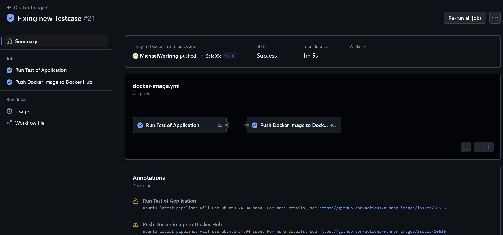

# Containerized DevOps pipeline for deploying a Node.js application in Azure Web Apps

- `Group`: Werfring, Tuka, Koch, Streimel 
- `Production Site`: https://production-werfringstreimeltukakoch-f7hhbvfscmbbf4hp.germanywestcentral-01.azurewebsites.net/ 
- `Developemet Site`: https://werfringstreimeltukakoch-eweyb9hggxfybcgy.germanywestcentral-01.azurewebsites.net/

## Description
The deployment pipeline was set up using `Azure Web Apps` to deploy a `Node.js` backend. 

When changes are pushed to the main branch by the developer, a `GitHub action` is triggered that automatically runs the `Unit Tests` using `Jest` (selected due to it's simplicity). If all tests pass, a `Docker Image` is built and pushed to the `Docker Registry`. 

The Azure Web App is updated using a `WebHook` and deploys the new Docker image to the `Development Site` first. The URL for the WebHook was taken from the Azure Web App and configured in the Docker registry to create updates automatically. 

If the changes are to be taken to `Production Branch`, a `Pull Request` on GitHub is made and has to be approved by at least one person. This deploys the changes to the production site. 

## How to deploy changes
1. 'Push` changes to main branch 
2. Wait for `GitHub Action` to finish
3. See changes on `Developement` site 
4. Create `Pull Request`: Main -> Release 
5. Wait for Pull Request to be accepted 
6. Wait for `GitHub Action` to finish 
7. See changes on `Production` site 

## Docker-image-registry 
Changes pushed to branches main and release are automatically build as a docker image and published to the docker registry:

https://hub.docker.com/repository/docker/marvincook/swdwstk/general 

### GitHub Actions

